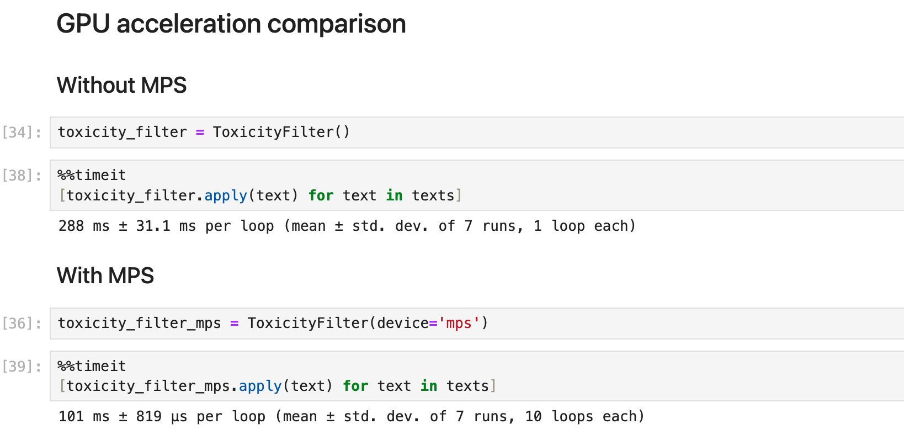

# TextProcessingModule
**Background**: This module was developed during an internship at **Deutsche Museum Nürnberg (Zukunftsmuseum)** 
as a protective prompt filtering mechanism for a possible interactive installation featuring 
an image generation pipeline from speech to image. It was designed to **process english language** (see [Multilingualism](#multilingualism)).

The **TextProcessingModule** has two **submodules**:
1. **ToxicityFilter**: Provides the ToxicityFilter, a two-tiered approach to **filter texts containing toxic language**, and a SpanDetector which can return the span or characters of toxic parts in a text.
2. **KeywordExtractor**: It provides keyword extraction with **tagging** and **HTML highlighting** functionality.  

> [!WARNING]
> The word lists in `TextProcessingModule` and the examples used in the `DEMO_*.ipynb` files contain **offensive langauge**, so be aware of that.

> [!NOTE] 
> As a first filter stage `ToxicityFilter` uses **word lists**. These lists **should be reviewed and maybe manually adapted** since they are not extensive. They might be too rigorous or not rigorous enough for a given purpose.
> They can be found in the **TextProcessingModule** folder.

> [!NOTE]
> When the second filter stage (detoxify) is applied, it uses a **default threshold** for the input texts toxicity of 0.5.
> Please experiment and dial in this value.

---
Table of content
- [Installation](#installation)
- [Usage](#usage)
- [Explanation](#explanation)
    - [Toxicity Filter](#toxicity-filter)
    - [Span Detection](#span-detection)
    - [Keyword Extraction](#keyword-extraction)
- [Multilingualism](#multilingualism)
- [Attributions](#attributions)

---
## Installation
- Download the `requirements.txt` file to your desired working directory.
- In your working directory:
    - [optional] Create a virtual environment: `python -m venv venv`
    - [optional] Run `source venv/bin/activate` to activate the environment)
    - Install the required packages: `pip install -r requirements.txt`

[verify!] Alternatively, if you use conda, you can use a pre-configured virtual conda environment. To install it:
- Download the `tpm-venv_scratch.yml` file into your working directory
- In your working directory run:
```bash
conda env create -p ./tpm-venv -f ./tpm-venv_scratch.yml
```
to create a new conda environment named `tpm-venv` inside your working directory or

```bash
conda env create -n tpm-venv -f ./tpm-venv_scratch.yml
```

to create it in condas standard location for environments.


- Finally: Download the `TextProcessingModule` folder into your working directory

Now you can import it like any python module inside your working directory.

To try out TextProcessingModule you can download our **Jupyter Notebook demos** `DEMO_*.ipynb` to your working directory.
This requires **jupyter-notebook or jupyter-lab** to be installed (e.g. via `pip install jupyterlab`) or an IDE that supports jupyter-notebooks.
You might also want to run `pip install ipywidgets` to circumvent any error messages regarding `tqdm`. 

---


## Usage:
TextProcessingModule provides 
- **toxicity filtering**,
- **toxic span detection** and
- **keyword extraction**.

See the `DEMO_ToxicityFilter.ipynb`, `DEMO_ToxicSpanDetection.ipynb` and `DEMO_KeywordExtraction.ipynb` for **comprehensive usage examples**.
> They can be viewed within GitHub. However, if you want to use and execute them locally, [Jupyter](https://jupyter.org/install) must be installed or your IDE must support jupyter notebooks.
---

## Explanation
### Toxicity Filter
`TextProcessingModule.toxicity_filter` provides the ToxicityFilter class. ToxicityFilter uses a two-tiered filter approach:

1. Strictly **filtering** prompts **by basic lists** of vulgar or swear words, immediately neglecting the input text upon match.
2. **Detecting** more subtle forms of problematic textual information like **threats, obscenity, insults, and identity-based hate** using [detoxify](https://github.com/unitaryai/detoxify) if the first filter stage was passed. A **threshold** (range [0; 1]; defautl: 0.5) can be used to sharpen the filter.

ToxicityFilter will first run the text against a default (or custom) wordlist and return 1 if there is a match, bypassing the second filter.
Only if there is no match, the text is passed through the second filter (detoxify).

Detoxify rates a prompt in five different categories and assigns an overall toxicity value. ToxicityFilter takes this value and compares it to the threshold. If the **threshold is exceeded**, a `1` is returned otherwise `None`.


Some input may trigger the first stage:


> Note that the verbose output contains the problematic tokan that was matched against the wordlist or `None` if there was no match.


And some input may trigger the second filter:


> Note that we had to dial down the threshold to make the filter trigger without using foul language of some sort.


ToxicityFilter also stores **verbose results** of the last apply call. Use `toxicity_filter.get_results()` to get them. You can pass `as_dataframe=True` to get a more beautified output:


> - Note that in the first column the toxic token is `None` because only the second filter stage triggered.
> - Also note that the data frame view of the results still needs improvement since the toxic categories ('severe_toxicity', etc.)
> are cut off. Better leave `as_dataframe` at **default value (False)**, which will then give you the **results as dictionary**.


If you only are interested in the second filters results, you can get them like so:


By default, these verbose results are only stored for the **last apply call**. Results for consecutive uses of the filter can be stored by passing
`keep_results=True` to its constructor or by using `toxicityfilter.set_keep_results(True)` as a setter:


> [!NOTE]
> Please also check out the **comparison of the filter stages** as conducted in the [DEMO_ToxicityFilter.ipynb](DEMO_ToxicityFilter.ipynb) notebook
> to get an inpression about **behaviour and limitations**.

> #### Additional Notes
> - The texts are tokenized but not lemmatized prior applying the word list filter. This will be a future improvemen
> - You can provide your custom wordlist for the first filter stage.
> - The two filter stages can also be used **separately** (see [DEMO_ToxicityFilter.ipynb](DEMO_ToxicityFilter.ipynb))
> - ToxicityFilter can be initialized with **three different models**: 'original' (default), 'unbiased', 'multilingual'. The model names are passed down to [detoxify](https://github.com/unitaryai/detoxify); see their documentation for **model explanation**. 

---
### Span Detection
The `toxicity_filter` submodule also provides a class `SpanDetector`.
It can return the **character span of toxic parts** of a text. 
It also provides **additional functionality** for returning the input text:
- **Sanitize the input**, i.e. replacing toxic characters with a custom character (default: '*').
- **Tag the input** with a custom tag.
- **HTML highlighting** of toxic spans.

> See [`DEMO_ToxicSpanDetection.ipynb`](DEMO_ToxicSpanDetection.ipynb) for usage examples.


### Keyword Extraction
`TextProcessingModule.keyword_extraction` provides the `KWExtractor` class.
It uses [yake](https://github.com/LIAAD/yake) for extraction and provides additional **custom tagging** and **HTML highlighting** as well.

It was thought to help the speech to text pipeline reduce spoken input to meaningful words for the image generation prompt.

> See [`DEMO_KeywordExtraction.ipynb`](DEMO_KeywordExtraction.ipynb) for usage examples.


---
## Multilingualism
> [!NOTE]
> The speech to image pipeline this module was designed for, would translate speech into english text as an image
> generation prompt. Thus, `TextProcessingModule` was **tailored to English**.
> Although technically some of the dependencies in use provide **multilingualism** to some extent, you would still need
> to provide your own wordlists for the desired language and the code may need further improvement to fully support multilingualsim.

---
## GPU acceleration
when instantiating the filter, it is possible to pass `device='cuda'` or `device='mps'` (Metal Performance Shader; macOS) as additional keyword argument
which will be passed down to the detoxify dependency.

While the first apply call to the filter takes two to three seconds longer due to the model being moved to the gpu, all following calls will be
accelerated quite a bit.

For the list of example texts given in section [Toxicity Filter](#toxicity-filter), it **increases speed to roughly 290%** (on an **Apple M1 Pro with 14-Core GPU**).



---
## Attributions
- **Tokenization** of texts prior applying the word list filter is done using **SoMaJo** (see: https://github.com/tsproisl/SoMaJo)
- The **word list** for span detection was taken from [erikdyan/toxic_span_detection](https://github.com/erikdyan/toxic_span_detection/blob/981c7f2d7fba6625a7cb57678d80ef0341b3288b/data/wordlist.txt)
- The second filter stage (toxicity classification) uses [detoxify](https://github.com/unitaryai/detoxify)
- For **keyword extraction** [yake](https://github.com/LIAAD/yake) is used.
- For **toxic span detection** [mudes](https://pypi.org/project/mudes/) is used.
